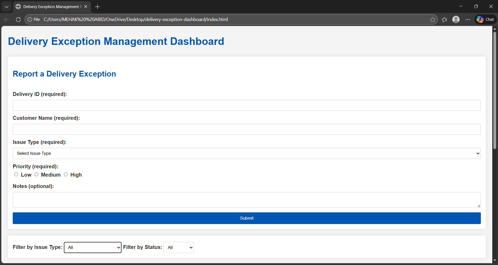
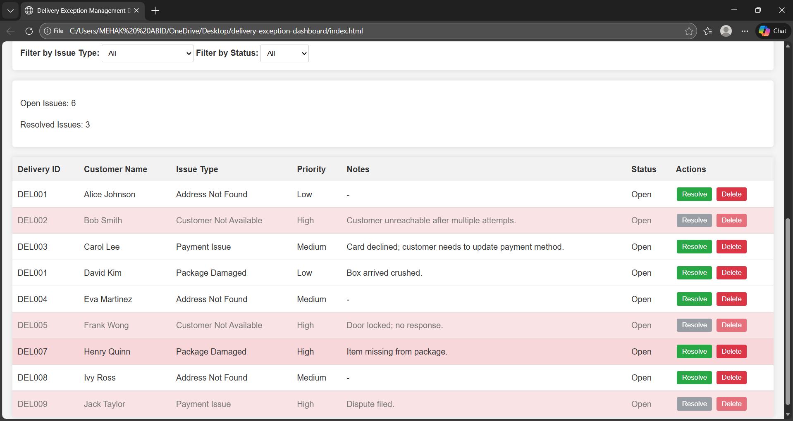

# Delivery Exception Management Dashboard

A simple, static web application for logging, tracking, and managing delivery exceptions in a corporate environment.
Built with HTML, CSS, and JavaScript, it allows users to report issues, view them in a table, filter by type/status, and perform actions like resolving or deleting entries.
No backend or frameworks required – runs directly in the browser.

## Features
- **Form Submission**: Report delivery exceptions with required fields (Delivery ID, Customer Name, Issue Type, Priority) and optional notes.
- **Dynamic Table**: Displays exceptions with columns for ID, Name, Type, Priority, Notes, Status, and Actions.
- **Filtering**: Filter exceptions by Issue Type and Status without losing data.
- **Actions**: Resolve issues (changes status and visually indicates) or delete with confirmation.
- **Counts and Highlights**: Real-time counts of open/resolved issues; high-priority rows highlighted in red.
- **Responsive UI**: Clean, professional design with neutral colors, suitable for desktop use.
- **Validation**: Ensures required fields are filled before submission.

## Technologies Used
- **HTML**: Structure and form elements.
- **CSS**: Styling for layout, colors, and responsiveness.
- **JavaScript**: DOM manipulation for interactivity (no libraries or frameworks).

## How to Run Locally
1. Clone the repository: `git clone https://github.com/mohdabid4333-dotcom/delivery-exception-dashboard.git`.
2. Navigate to the folder: `cd delivery-exception-dashboard`.
3. Open `index.html` in a web browser (e.g., double-click the file or use a local server like `python -m http.server`).
4. Start using the dashboard: Submit forms, filter, and manage exceptions.

## Live Demo
View the live version hosted on GitHub Pages: [https://mohdabid4333-dotcom.github.io/delivery-exception-dashboard](https://mohdabid4333-dotcom.github.io/delivery-exception-dashboard).

## Screenshots

## Testing
- Submit sample exceptions using the form (e.g., Delivery ID: "DEL001", Customer Name: "John Doe", Issue Type: "Address Not Found", Priority: "High").
- Test filters, actions, and counts. Refer to the project's testing guide for examples.
- Ensure it works in modern browsers (Chrome, Firefox, Edge).

## Project Structure
HTML File: [index.html](index.html)
CSS File: [styles.css](styles.css)
JavaScript File: [script.js](script.js)

## Contributing
Feel free to fork the repo, make improvements, and submit a pull request. Suggestions welcome!

## License
This project is open-source under the MIT License. See [LICENSE](LICENSE) for details.

## Contact
Created by [Mehak Abid](https://github.com/mohdabid4333-dotcom). For questions, open an issue on GitHub.
